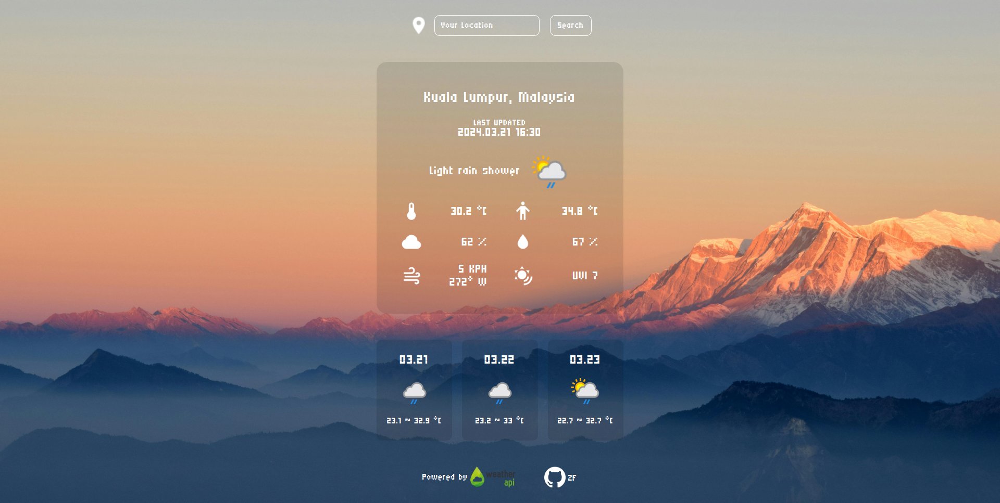
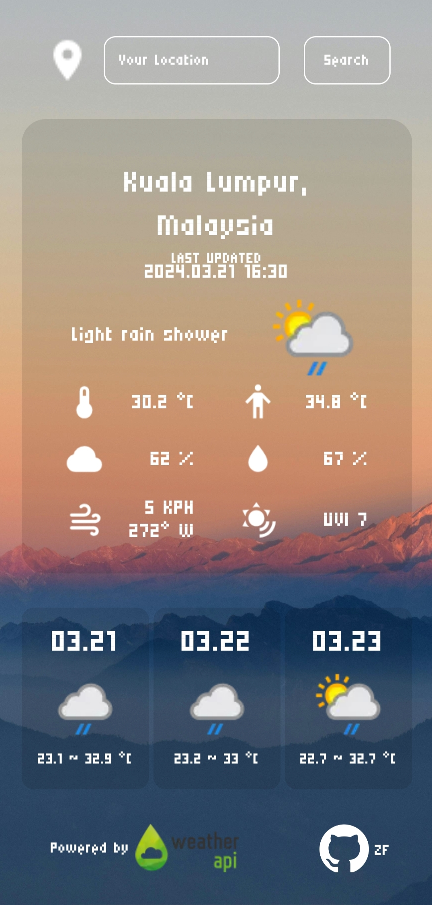

# Weather App
### Live Demo: https://woonzf.github.io/odin-weather-app/
### Description:
- A mobile-friendly weather app that provides current and forecast weather information
- Inspired by DAVE THE DIVER in-game weather app
- Created as a project of The Odin Project's Javascript Course

### Screenshots:
 

### Languages used:
- HTML
- CSS
- JavaScript

### API used:
- Weather API: https://www.weatherapi.com/

### Module Bundler:
- Webpack

### Resources:
- Font: https://fonts.google.com/specimen/Micro+5
- GitHub logo: https://github.com/logos
- Background Image: https://www.pexels.com/photo/black-mountain-38326/
- Icons: https://pictogrammers.com/library/mdi/
- Favicon: https://www.flaticon.com/free-icons/weather